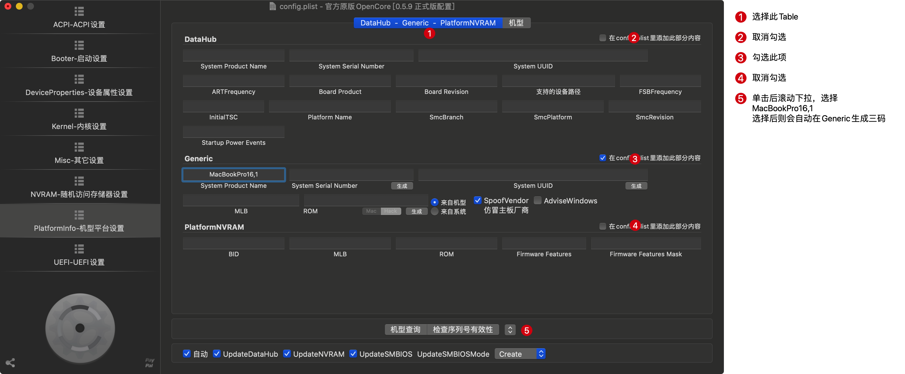
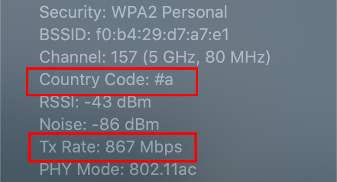

[](https://github.com/CyrilTaylor/Legion-Y9000X-Hackintosh/releases)
[](https://github.com/CyrilTaylor/Legion-Y9000X-Hackintosh/blob/main/LICENSE)

# :warning:版本尚未发布，还存在若干问题，请勿直接用于实际引导

<!-- TOC -->

- [1. 硬件配置](#1-硬件配置)
- [2. 功能支持详情](#2-功能支持详情)
- [3. BIOS设置](#3-bios设置)
- [4. 自定义配置](#4-自定义配置)
  - [4.1. SSD屏蔽设置](#41-ssd屏蔽设置)
  - [4.2. 平台三码配置**（必需）**](#42-平台三码配置必需)
  - [4.3. CFG Lock解锁配置](#43-cfg-lock解锁配置)
  - [4.4. 显示器1080P FHD版本适配](#44-显示器1080p-fhd版本适配)
- [5. 版本详情](#5-版本详情)
- [6. 启动参数说明](#6-启动参数说明)

<!-- /TOC -->

## 1. 硬件配置

- Y9000X配置参数

|   硬件    | 型号                                                         |
| :-------: | :----------------------------------------------------------- |
|    CPU    | Intel i7-9750H                                               |
|  显示器   | UHD 4K                                                       |
| WiFi/蓝牙 | Intel AX200<br />黑苹果支持不完美，已更换为DW1820A，并且屏蔽前三后二总共五个引脚 |
|   硬盘    | 三星PM981A<br />黑苹果大量读写数据时异常，基本无解，已更换为铠侠RD10（原东芝RD500）1TB SSD |

- EFI测试环境

|     类型     | 配置                                       |
| :----------: | :----------------------------------------- |
|   操作系统   | macOS 10.15.5                              |
| 显示器分辨率 | 4K                                         |
|   固态硬盘   | 铠侠RD10 1TB，并且屏蔽第二个磁盘位的PM981A |
|  WiFi/蓝牙   | 博通DW1820A                                |

## 2. 功能支持详情

- :white_check_mark: 4K内置显示器
- :warning: 开机/休眠唤醒暗屏/花屏
- :white_check_mark: 电池管理、电池电量显示
- :warning: 开/合盖唤醒/休眠
- :warning: 电源键短按休眠/唤醒
- :warning: 开启深度休眠，以更加省电，电源键/开盖唤醒
- :white_check_mark: CPU温度传感器
- :warning: 扬声器节点注册
- :warning: 3.5mm耳机
- :warning: 内置麦克风
- :white_check_mark: 摄像头
- :warning: 核显1.2G满频支持
- :warning: 显示器亮度调节（映射到`Fn+F11`、`Fn+F12`）
- :warning: 音量调节（映射到`Fn+F2`、`Fn+F3`）
- :warning: 静音（映射到`Fn+F1`）
- :warning: 暂停/播放（映射到`Fn+Home`）
- :white_check_mark: 触控板（GPIO中断方式、支持多指手势）
- :white_check_mark: WiFi（支持所有信道、解除速率限制）
- :white_check_mark: 蓝牙
- :white_check_mark: AirDrop
- :white_check_mark: Type-C PD充电
- :white_check_mark: Type-A USB3.1接口*2
- :white_check_mark: Type-C USB接口*1
- :white_check_mark: Type-C扩展坞（USB、以太网、HDMI2.0、DP）
- :white_check_mark: Type-C雷电接口
- :white_check_mark: 电源按钮环灯及logo灯开关控制（BIOS自带快捷键`Fn+L`）
- :white_check_mark: 键盘背光灯亮度调节（BIOS自带快捷键`Fn+Space`）

------

- :red_circle: 指纹识别（因macOS系统安全性限制不可实现）
- :red_circle: 除上述已声明可用之外的Fn组合快捷键均不可用
- :red_circle: 内置扬声器
- :red_circle: SD卡读卡器

## 3. BIOS设置

- :white_check_mark: 磁盘模式设置为AHCI模式`Configuration -> Storage -> Controller Mode -> AHCI mode`

  :warning: <span style="color:red"><u>**从RST(RAID0)模式切换为AHCI模式，磁盘上的所有数据会被清除，所以请提前备份好磁盘重要数据！**</u></span>

- :white_check_mark: 关闭安全启动`Security -> Secure Boot -> Disabled`

- :white_check_mark: 安装完成后将黑苹果所在的磁盘调节为第一启动顺序，如此每次开机默认进入黑苹果系统

## 4. 自定义配置

### 4.1. SSD屏蔽设置

  仓库默认配置没有屏蔽任何磁盘位，假如需要屏蔽磁盘位，使能指定的ACPI补丁。<span style="color:red"><u>**两个补丁最多只能使能其中一个，否则两个磁盘都将识别不出来，从而无法进入系统！**</u></span>

  - 屏蔽第一个磁盘位（靠近风扇位置，默认不屏蔽）

    `OpenCore Configurator -> ACPI -> Add -> SSDT-NVME1-DISABLE.aml: true`

    ```diff
    diff --git a/EFI/OC/config.plist b/EFI/OC/config.plist
    index 5b1bfc6..104b515 100644
    --- a/EFI/OC/config.plist
    +++ b/EFI/OC/config.plist
    @@ -10,7 +10,7 @@
                                    <key>Comment</key>
                                    <string>Disable SSD 1 on NVME</string>
                                    <key>Enabled</key>
    -                               <false/>
    +                               <true/>
                                    <key>Path</key>
                                    <string>SSDT-NVME1-DISABLE.aml</string>
    ```

  - 屏蔽第二个磁盘位（靠近电池位置，默认不屏蔽）

    `OpenCore Configurator -> ACPI -> Add -> SSDT-NVME2-DISABLE.aml: true`

    ```diff
    diff --git a/EFI/OC/config.plist b/EFI/OC/config.plist
    index 5b1bfc6..911f084 100644
    --- a/EFI/OC/config.plist
    +++ b/EFI/OC/config.plist
    @@ -18,7 +18,7 @@
                                    <key>Comment</key>
                                    <string>Disable SSD 2 on NVME</string>
                                    <key>Enabled</key>
    -                               <false/>
    +                               <true/>
                                    <key>Path</key>
                                    <string>SSDT-NVME2-DISABLE.aml</string>
    ```

### 4.2. 平台三码配置**（必需）**

  `OpenCore Configurator -> PlatformInfo -> Genric`

  :warning: <span style="color:red">**仓库默认配置是清除了三码的，所以需要使用者填充自己的三码。**</span>仓库目前最新的Release版本里config.plist是用[OpenCore Configurator v2.6.0.2](https://mackie100projects.altervista.org/occ-changelog-version-2-6-0-0/)版本编辑的，想用OpenCore Configurator编辑并且生成三码的，则也必需用同样版本的OpenCore Configurator。

  ```diff
  diff --git a/EFI/OC/config.plist b/EFI/OC/config.plist
  index 12596e4..45d83e3 100644
  --- a/EFI/OC/config.plist
  +++ b/EFI/OC/config.plist
  @@ -1285,17 +1301,17 @@
                          <key>AdviseWindows</key>
                          <false/>
                          <key>MLB</key>
  -                       <string></string>
  +                       <string>*****************</string>
                          <key>ROM</key>
  -                       <data></data>
  +                       <data>********</data>
                          <key>SpoofVendor</key>
                          <true/>
                          <key>SystemProductName</key>
                          <string>MacBookPro16,1</string>
                          <key>SystemSerialNumber</key>
  -                       <string></string>
  +                       <string>************</string>
                          <key>SystemUUID</key>
  -                       <string></string>
  +                       <string>********-****-****-****-************</string>
                  </dict>
                  <key>UpdateDataHub</key>
                <true/>
  ```

  OpenCore Configurator中填充三码：

  

### 4.3. CFG Lock解锁配置

此项修改为非必需项，不做任何修改也可正常使用。

- 已解锁CFG Lock

  本配置默认是适配已解锁CFG Lock的，假如已解锁，无需做任何修改。

- 未解锁CFG Lock

  未解锁CFG Lock的，需要将如下三项配置打开

  - `OpenCore Configurator -> Kernel -> Quirks-> AppleCpuPmCfgLock: true`
  - `OpenCore Configurator -> Kernel -> Quirks-> AppleXcpmCfgLock: true`
  - `OpenCore Configurator -> UEFI -> Quirks-> IgnoreInvalidFlexRatio: true`

### 4.4. 显示器1080P FHD版本适配

`OpenCore Configurator -> NVRAM -> 4D1EDE05-38C7-4A6A-9CC6-4BCCA8B38C14 -> UIScale: 01`

对于1080P显示器版本，需要将`UIScale`设置为`1`

```diff
diff --git a/EFI/OC/config.plist b/EFI/OC/config.plist
index 5b1bfc6..0bac981 100644
--- a/EFI/OC/config.plist
+++ b/EFI/OC/config.plist
@@ -980,7 +1074,7 @@
                                <key>DefaultBackgroundColor</key>
                                <data>AAAAAA==</data>
                                <key>UIScale</key>
-                               <data>Ag==</data>
+                               <data>AQ==</data>
                        </dict>
                        <key>4D1FDA02-38C7-4A6A-9CC6-4BCCA8B30102</key>
                        <dict>
```

## 5. 版本详情

- ACPI（高级配置及电源接口）补丁注入

|      SSDT注入补丁      |                         SSDT替换补丁                         | 描述                                    |
| :--------------------: | :----------------------------------------------------------: | --------------------------------------- |
| SSDT-NVME1-DISABLE.aml |                              无                              | 屏蔽第一个磁盘位                        |
| SSDT-NVME2-DISABLE.aml |                              无                              | 屏蔽第二个磁盘位                        |
|      SSDT-EC.aml       |                              无                              | 仿冒EC设备                              |
|     SSDT-GPI0.aml      | GPI0域内<br />查找：_STA (`5F 53 54 41`)<br />替换：XSTA (`58 53 54 41`) | 启用GPI0                                |
|     SSDT-TPAD.aml      | TPAD域内<br />查找：_CRS (`5F 43 52 53`)<br />替换：XCRS (`58 43 52 53`) | 变更TPAD模式为GPIO中断模式              |
|           无           | 查找：USTP (`55 53 54 50 08`)<br />替换：XSTP (`58 53 54 50 08`) |                                         |
|     SSDT-ALS0.aml      |                              无                              | 仿冒环境光传感器                        |
|     SSDT-GPRW.aml      | 查找：GPRW (`47 50 52 57 02`)<br />替换：XPRW (`58 50 52 57 02`) | 修正某些部件休眠唤醒与macOS的兼容性问题 |
|                        |                                                              |                                         |

- 驱动和内核扩展

|                          类型                          |                             模块                             |         版本          | 描述                             |
| :----------------------------------------------------: | :----------------------------------------------------------: | :-----------------: | :------------------------------- |
| [OpenCore](https://github.com/acidanthera/OpenCorePkg) |                              ==                              |       v0.5.9        | ==                               |
|                        Drivers（OpenCore驱动）                        | OpenRuntime.efi | OpenCore内置 | 内存寻址补丁 |
|                           ..                           | VBoxHfs.efi | OpenCore Configurator下载 | HFS格式支持 |
|                           ..                           | Apfs.efi | macOS 10.15.5镜像提取 | APFS格式支持 |
|                        Kexts（内核扩展）                        |       [Lilu.kext](https://github.com/acidanthera/Lilu)       |       v1.4.5        | Acidanthera驱动全家桶的底层依赖，需第一个加载 |
|                           ..                           | [VirtualSMC.kext](https://github.com/acidanthera/VirtualSMC) |       V1.1.4        | 传感器驱动依赖                   |
|                           ..                           | [WhateverGreen.kext](https://github.com/acidanthera/WhateverGreen) |       V1.4.0        | 核显&显卡驱动                    |
|                           ..                           | [USBInjectAll.kext](https://github.com/Sniki/OS-X-USB-Inject-All) |       v0.7.1        | USB万能驱动（可使用自定制USB补丁） |
| .. | VoodooI2C.kext/Contents/<br />PlugIns/VoodooI2CServices.kext | VoodooI2C.kext子驱动 | VoodooI2C.kext依赖服务，需在VoodooI2C.kext前加载 |
| .. | VoodooI2C.kext/Contents/<br />PlugIns/VoodooGPIO.kext | VoodooI2C.kext子驱动 | VoodooI2C.kext依赖服务，需在VoodooI2C.kext前加载 |
| .. | VoodooI2C.kext/Contents/<br />PlugIns/VoodooInput.kext | VoodooI2C.kext子驱动 | VoodooI2C.kext依赖服务，需在VoodooI2C.kext前加载 |
|                           ..                           |   [VoodooI2C.kext](https://github.com/VoodooI2C/VoodooI2C)   |       v2.4.3        | I2C总线设备驱动                  |
|                           ..                           |                      VoodooI2CHID.kext                       | VoodooI2C.kext内置  | I2C-HID设备驱动，依赖VoodooI2C.kext，需在VoodooI2C.kext后加载 |
|                           ..                           |                      SMCProcessor.kext                       | VirtualSMC.kext内置 | CPU核温度传感器驱动              |
|                           ..                           |                       SMCSuperIO.kext                        | VirtualSMC.kext内置 | IO传感器驱动                     |
|                           ..                           | [IntelMausi.kext](https://github.com/acidanthera/IntelMausi) |       V1.0.3        | Intel类千兆网卡驱动              |
|                           ..                           |   [AppleALC.kext](https://github.com/acidanthera/AppleALC)   |       V1.5.0        | 万能声卡驱动                     |
|                           ..                           |    [NVMeFix.kext](https://github.com/acidanthera/NVMeFix)    |       v1.0.2        | 为NVME硬盘增加ASPT属性来保证节电 |
|                           ..                           |  [NoTouchID.kext](https://github.com/al3xtjames/NoTouchID)   |       v1.0.3        | 指纹屏蔽驱动                     |
|                           ..                           | [VoodooPS2Controller.kext](https://github.com/acidanthera/VoodooPS2) |       v2.1.5        | 触控板驱动                       |
|                           ..                           | [AirportBrcmFixup.kext](https://github.com/acidanthera/AirportBrcmFixup) |       v2.0.7        | 非原生博通WiFi模块Airport驱动<br />添加[属性值](https://github.com/acidanthera/AirportBrcmFixup#boot-args)配置brcmfx-country=#a，以支持特殊信道及提升传输速率 |
|                           ..                           | [HibernationFixup](https://github.com/acidanthera/HibernationFixup) |       v1.3.3        | 休眠驱动                         |
|                           ..                           |  [CPUFriend.kext](https://github.com/acidanthera/CPUFriend)  |       V1.2.0        | Lilu动态电源管理数据注入插件     |
|                           ..                           |                        USBPorts.kext                         |                     |                                  |
|                           ..                           |                        USBPower.kext                         |                     |                                  |
|                           ..                           |                      [BrcmPatchRAM.kext](https://github.com/acidanthera/BrcmPatchRAM)                      | v2.5.3 |                                  |
| .. | BrcmFirmwareData.kext | BrcmPatchRAM.kext内置 | |
|                           ..                           |                  BrcmBluetoothInjector.kext                  | BrcmPatchRAM.kext内置 |                                  |
|                           ..                           |  [VoodooInput](https://github.com/acidanthera/VoodooInput)   |                     |                                  |

## 6. 启动参数说明

- -no_compat_check 关闭兼容性检查

- slide=1 手动设置 KASLR slide 值为`1`，需配合`Booter -> Quirks -> ProvideCustomSlide: true`一起使用

- brcmfx-country=#a（已移至`DeviceProperties`）

  设置WiFi国家代码为ALL，以支持全部的[WiFi信道](https://zh.wikipedia.org/wiki/WLAN信道列表)，并解锁因此导致的带宽速率限制

  

<u>**参考资料:**</u>

[^1]: [精解OpenCore | 黑果小兵的部落阁](https://blog.daliansky.net/OpenCore-BootLoader.html)

[^2]: [OpenCore 部件补丁](https://ocbook.tlhub.cn)

[^3]: [github | WangRicky/Y9000X-HACKINTOSH](https://github.com/WangRicky/Y9000X-HACKINTOSH)
